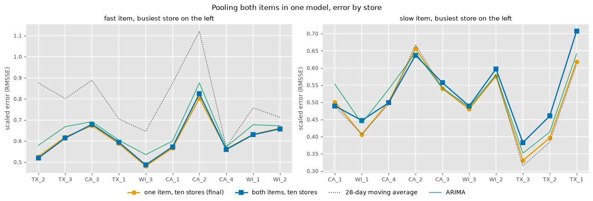
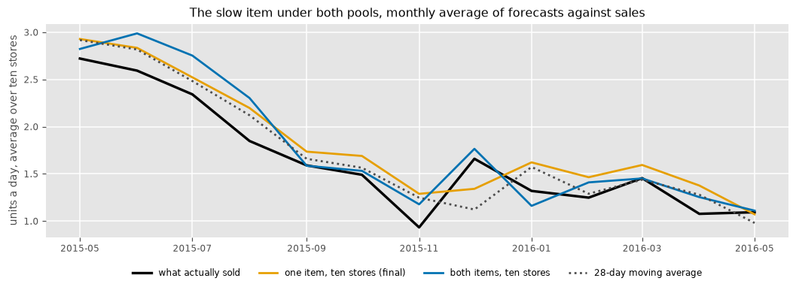

# Item 9, both items in one pool

Dated 2026-09-25. Branch `exp-xgb-quick-wins`. The question was whether the
pool can grow. M5 has ten stores and the final model already trains on all
of them, so the only way to add rows is across items. This run puts both
study items, twenty series, in one level-relative XGBoost
(`Config(item_ids=both, pool_by="cat_id")`) and scores each item against
its own single-item pool. Every other setting is the final model's.

## Result on the reported layout

Every-day layout, 358 origins, ten stores, item-8 code. Run
`xgboost_rel_22658314c09f`, paired against `xgboost_rel_b238c9be2358` (fast)
and `xgboost_rel_62303e0141e9` (slow).

| item | model | RMSSE | normal | holiday | bias | paired against the single-item pool |
|---|---|---|---|---|---|---|
| fast | one item, ten stores (final) | 0.611 | 0.599 | 0.665 | +0.21 | |
| fast | both items, ten stores | 0.614 | 0.601 | 0.670 | +0.16 | better in 49% of store-weeks, median −0.2% |
| slow | 28-day moving average | 0.497 | 0.497 | 0.500 | +0.08 | |
| slow | one item, ten stores (final) | 0.501 | 0.499 | 0.508 | +0.18 | |
| slow | both items, ten stores | 0.527 | 0.510 | 0.599 | +0.16 | better in 43% of store-weeks, median −2.2% |

On the fast item the two pools tie. On the slow item the shared pool loses
0.026, almost all of it in holiday weeks (0.508 to 0.599), and it loses at
seven of ten stores. The weekly layout gave the same picture (0.617 against
0.615 on the fast item, 0.525 against 0.501 on the slow one).

*Error by store under the two pools. The shared pool tracks the single-item
pool on the fast item and sits above it at most stores on the slow item,
worst at the Texas stores.*

## Where the loss comes from

The slow item's forecast on holiday-window days, averaged over the year:

| model | outside holiday windows | inside holiday windows |
|---|---|---|
| actual | 1.57 | 1.81 |
| one item, ten stores | 1.76 | 1.88 |
| both items, ten stores | 1.67 | 2.53 |

Outside holiday windows the shared pool is the closer of the two. Inside
them it forecasts 2.5 units a day for an item that sells 1.8. The
level-relative target is sales minus the 28-day mean, in units, so a
holiday effect learned on an item selling 60 a day is an additive lift of
tens of units, and the trees carry some of that across to an item selling
under two. The item identity is a feature, so the trees can split on it,
but the squared-error loss is dominated by the fast item's residuals (about
fifty times larger) and the split is not worth enough to the fit.

Holiday-week error and bias by store on the slow item confirm it. Bias
under the shared pool is higher at every store, by 0.1 to 0.4 units a day,
and the error is worse at nine of ten (TX_1 0.65 to 0.91, TX_2 0.36 to
0.61).

*The slow item's monthly level under both pools. The shared pool follows
the level as well as the single-item one, and overshoots in the two
holiday months.*

## What it says

1. The pool cannot grow across items with the target in units. Sharing a
   model between items fifty times apart in volume needs the target on a
   common scale, so that a holiday is "plus 40%" on both rather than "plus
   30 units" on one.
2. The natural fix is a proportional target, sales divided by the 28-day
   level (or the log of that ratio), with the forecast multiplied back.
   That is one module in `src/models/` and no change to the features or
   the harness, the same shape as the level-relative change in item 5.
3. Until then the final model stays one pool per item. The "design that
   scales" claim in the report is true of stores and untested across
   items, and the report should say so.

## Not done

- The proportional target above.
- Pooling items of similar volume (two fast movers), which would show
  whether the loss is about scale or about item identity.
- Weighting the loss per item so the slow item's rows count as much as the
  fast item's.

## Bookkeeping

- A first attempt used `STUDY_ITEMS`, which on this branch holds one item,
  so run `xgboost_rel_aaec10624a7d` (weekly) is the fast item alone under a
  `cat_id` key. It is identical to the single-item pooled run and can be
  ignored.
- Two other variants written on this branch, a Poisson objective and
  recency-weighted training rows, have dev-suite runs in the registry
  (`quick wins, dev check`) and nothing else yet.
