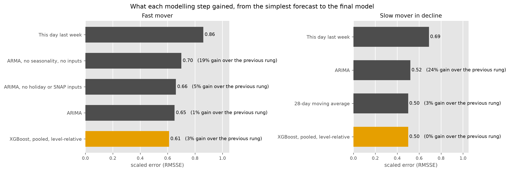
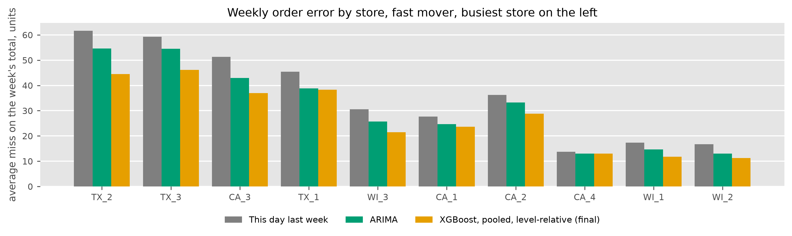

# Forecasting daily store demand

Wesley Gates, September 2026. Summary of a longer report.

A daily, store-level demand forecast, tested on a full year at ten stores
against the forecasts a planner would use without it. Public data (the M5
dataset of Walmart daily sales, with a calendar of holidays and SNAP
benefit days).

**84% of store-weeks** better than ordering from last week's number, by a
median of 28%, on a fast, regular mover.

**10 of 10 stores** better than ARIMA, the strongest statistical model,
over the full year.

**23% less weekly order error** than last week's number, 36 units a week
per store down to 27.6.

Five years of daily history, ten stores, 358 forecast origins per store,
3,580 scored store-weeks per method, ten methods (two benchmarks, four
statistical models and four machine learning variants), every model refit
at every origin.

*Figure 1. What each modelling step gained, from the simplest forecast
(top) to the final model (bottom, gold). The label on each bar is the
median gain over the step before it. The final model is a machine learning model, gradient-boosted
trees (XGBoost) trained across all ten stores on a level-relative target.
Each step is measured against the one before it, so the final model's
gain is over a strong statistical model.*

*Table 1. The fast mover, every day of the test year as a forecast
origin, for ten stores. Each rung is scored against the previous rung and
against the first, store-week by store-week. RMSSE is the scaled error
the M5 competition used, and 1.0 is last week's number on the training
history. Weekly error is the average miss on a week's total order, in
units. For the final model that is about 9% of a typical week's sales,
and 11% for last week's number.*

| rung | RMSSE | weekly error, units | vs the previous rung: weeks won | vs the previous rung: median gain | vs the previous rung: stores won of 10 | vs seasonal naive: weeks won | vs seasonal naive: median gain |
|---|---|---|---|---|---|---|---|
| This day last week (seasonal naive) | 0.86 | 36.0 | | | | | |
| ARMA, no seasonality, no inputs | 0.70 | 33.5 | 77% | 19% | 10 | 77% | 19% |
| ARIMA, no holiday or SNAP inputs | 0.66 | 32.7 | 65% | 5% | 10 | 82% | 24% |
| ARIMA | 0.65 | 31.5 | 58% | 1% | 9 | 83% | 25% |
| **XGBoost, pooled, level-relative (final)** | 0.61 | 27.6 | 58% | 3% | 10 | 84% | 28% |

On a slow mover in decline (0.6 to 7 units a day) a 28-day moving
average is the best forecast and the final XGBoost model ties it, so
items are routed by demand class before anything is fitted, the machine
learning model for steady daily movers and the simple average for the
rest. The machine learning model still beats last week's number in 82%
of store-weeks on this item and ARIMA at all ten stores.

*Table 2. The slow mover, the same methods scored against last week's
number. The full ladder is in the main report.*

| method | RMSSE | weekly error, units | weeks won vs seasonal naive | median gain vs seasonal naive |
|---|---|---|---|---|
| This day last week (seasonal naive) | 0.69 | 5.9 | | |
| ARIMA | 0.52 | 5.8 | 77% | 24% |
| **28-day moving average** | 0.50 | 5.1 | 82% | 26% |
| **XGBoost, pooled, level-relative (final)** | 0.50 | 5.2 | 82% | 26% |

## What the system does

- Forecasts a seven-day order window from every day of the year,
  refitting at each origin, the way an ordering system might use them.
- Holiday and SNAP effects measured from the data. Seven of thirty
  calendar events move this item's sales, and the model sees the days
  until and since each.
- Bias reported beside error throughout. A forecast that runs
  systematically high is shrink every week and one that runs low is a
  stockout.
- Every number reproducible to the byte. Each change to a model is scored
  against the previous version on the same 3,580 store-weeks, so noise
  shows up as a coin-flip win rate.
- A full-year evaluation of all methods on one item in about fifteen
  minutes, and a validator that has to pass before any number is quoted.

The model's inputs are recent sales (the last three days and the same
weekday over the last four weeks), the weekly pattern, the level and its
spread over the last week to two months, the calendar and how many days
ahead the forecast is, the days until and since the seven holidays that
matter, SNAP benefit days, and, in the pooled model, the store.

*Figure 2. The average miss on a week's total order, in units, by store,
busiest on the left. The final model misses by less than last week's
number at every store and by less than ARIMA at nine of ten, level at
the tenth. The busiest store benefits the most, 17 fewer units a week.*

## Next steps

- Turn the forecast into an order quantity at a chosen service level,
  which sets the trade-off between shrink and stockouts once, and score
  the orders on how often they would have run short.
- Extend the routing rule to intermittent items with Croston's method and
  its TSB variant, and to new items with no sales history (zero-shot).
- Add the yearly pattern with Fourier terms or an STL decomposition, the
  approach recommended for daily data with a yearly cycle (Hyndman et
  al., 2026, §13.1).
- Scale from two items and ten stores to a department of 800 items, with
  the run records in a shared SQL database.

Full report and code: github.com/wesGates/demand-forecasting (the first
study as reported is tag first-study there).

Hyndman, R. J., Athanasopoulos, G., Garza, A., Challu, C., Mergenthaler,
M., and Olivares, K. G. (2026). *Forecasting: Principles and Practice, the
Pythonic Way*. OTexts.

Makridakis, S., Spiliotis, E., and Assimakopoulos, V. (2022). M5 accuracy
competition. *International Journal of Forecasting*, 38(4), 1346–1364.
