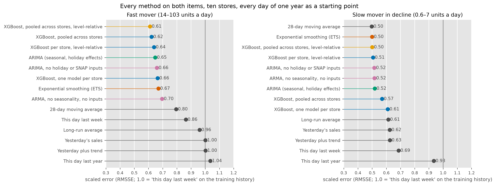
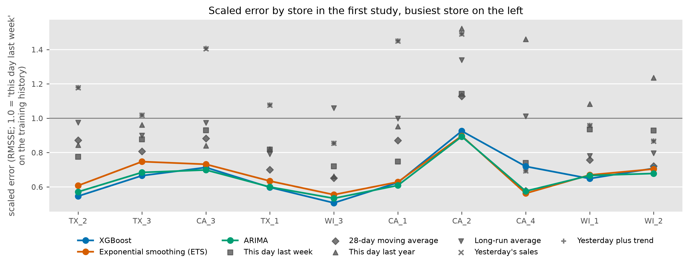
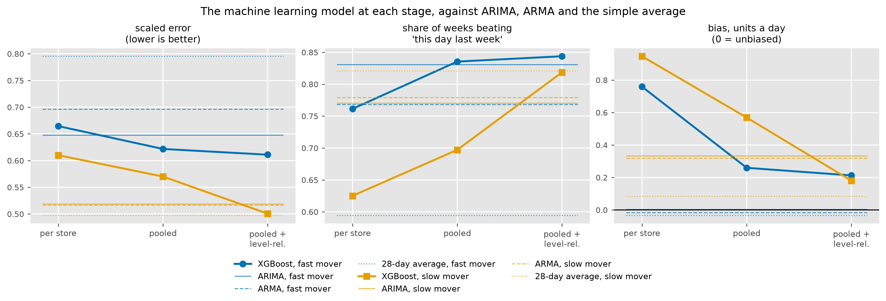
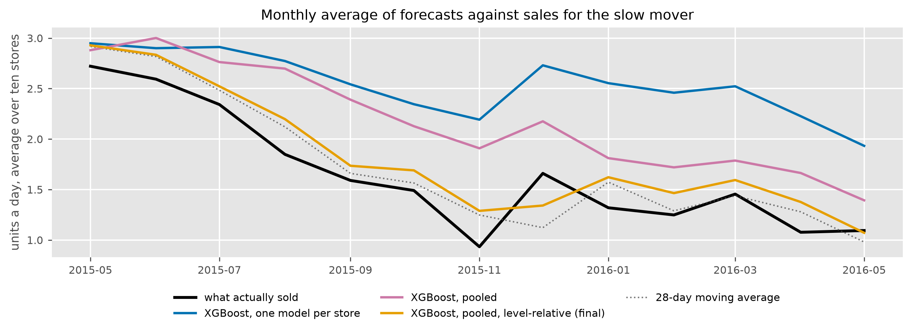
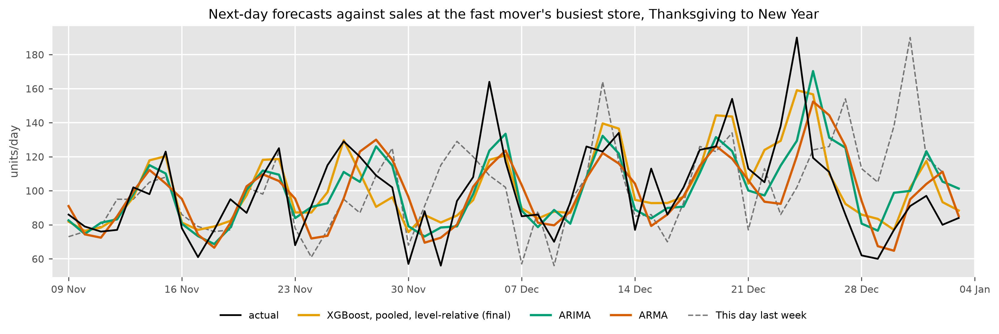

# Forecasting daily store demand

Wesley Gates, September 2026. Draft.

This project forecasts daily unit sales for one item at one store, seven
days ahead, the way a store ordering system might use it. It was tested by
standing on each day of one year, forecasting the next seven, and checking
what sold, at ten stores. The data is public (the M5 dataset of Walmart
daily sales for 2011–2016, with a calendar of holidays and SNAP benefit
days; Makridakis et al., 2022). The code behind every figure and table is
in one public repository, listed under References.

## Results

**84% of store-weeks** better than ordering from last week's number, by a
median of 28%, on a fast, regular mover.

**10 of 10 stores** better than ARIMA, the strongest statistical model,
over the full year.

**23% less weekly order error** than last week's number, 36 units a week
per store down to 27.6.

Five years of daily history, ten stores, 358 forecast origins per store,
3,580 scored store-weeks per method, ten methods (two benchmarks, four
statistical models and four machine learning variants), every model refit
at every origin.

Every error in this report is on one scale, the root mean squared scaled
error (RMSSE). It is the recommended measure for comparing accuracy across
series of different sizes (Hyndman et al., 2026, §5.8) and the measure the
M5 competition was scored on (Makridakis et al., 2022). Three properties
made it the choice here.

- It is scale-free, so a store selling 100 a day and one selling 15 can
  share a table.
- It is defined on days of zero sales, and the slow mover has many of
  them.
- Its unit is the error that "this day last week" made over each series'
  own history before the test year, so 1.0 always means "as good as last
  week's number used to be".

In the test year that benchmark scored 0.86 on the fast mover and 0.69 on
the slow one, and the models are read against those.

On a fast, regular mover (14 to 103 units a day depending on the store)
the final model scores 0.61. It is a machine learning model, gradient-boosted
trees (XGBoost; Chen and Guestrin, 2016) trained across all ten stores on a
level-relative target, both explained below. It beats last week's number in 84% of
store-weeks, by a median of 28%, and is the best method at seven of the
ten stores. Against ARIMA, the strongest statistical model here, it is ahead at
all ten stores over the year (median store gain 6% on daily error, 13% on
weekly totals) and wins 58% of individual store-weeks by a median of 3%.
Against a plain ARMA, with no seasonality and no holiday or SNAP inputs,
it is ahead at all ten stores (median store gain 12% on daily error, 18%
on weekly totals) and wins 69% of store-weeks. Its remaining over-forecast
is 0.2 units a day.

*Table 1. The fast mover, every day of the test year as a starting point,
ten stores. Bias is forecast minus actual in units a day. Shaded rows are
the final model and the two main baselines.*

| method | all weeks | normal | holiday | bias |
|---|---|---|---|---|
| **XGBoost, pooled, level-relative** | 0.61 | 0.60 | 0.67 | +0.2 |
| XGBoost, pooled | 0.62 | 0.61 | 0.68 | +0.3 |
| XGBoost, one per store, level-relative | 0.64 | 0.62 | 0.71 | +0.3 |
| **ARIMA** | 0.65 | 0.62 | 0.76 | 0.0 |
| ARIMA, no holiday or SNAP inputs | 0.66 | 0.63 | 0.80 | 0.0 |
| XGBoost, one per store | 0.67 | 0.65 | 0.74 | +0.8 |
| Exponential smoothing (ETS) | 0.67 | 0.64 | 0.82 | −0.1 |
| ARMA, no seasonality, no inputs | 0.70 | 0.67 | 0.82 | 0.0 |
| 28-day moving average | 0.80 | 0.77 | 0.90 | 0.0 |
| **This day last week (seasonal naive)** | 0.86 | 0.83 | 1.04 | 0.0 |

Table 2 reads as a ladder. Each row is one modelling step up from the row
before it, from the simplest forecast in the first row to the final model
in the last. The middle columns score each step against the previous one,
as the share of store-weeks it won, the median gain in those weeks, and
the number of stores where it came out ahead over the year. The
right-hand columns score every step against the first rung. Weekly error
is the average size of the miss on a week's total, in units, which is the
number an orderer feels, about 9% of a typical week's sales for the final
model and 11% for last week's number. Read down the table for what each
step gained. A fitted model of the recent level is worth the most over
last week's number, the weekly pattern comes next, the holiday and SNAP
inputs add a little, and the machine learning model is a modest step on
top of a strong statistical model, ahead at nine or ten stores on every
rung. Appendix
Table A1 has every method against every baseline.

*Table 2. The fast mover, from the simplest forecast to the final model.
Each rung is scored against the previous rung and against the first.*

| rung | RMSSE | weekly error, units | vs the previous rung: weeks won | vs the previous rung: median gain | vs the previous rung: stores won of 10 | vs seasonal naive: weeks won | vs seasonal naive: median gain |
|---|---|---|---|---|---|---|---|
| This day last week (seasonal naive) | 0.86 | 36.0 | | | | | |
| ARMA, no seasonality, no inputs | 0.70 | 33.5 | 77% | 19% | 10 | 77% | 19% |
| ARIMA, no holiday or SNAP inputs | 0.66 | 32.7 | 65% | 5% | 10 | 82% | 24% |
| ARIMA | 0.65 | 31.5 | 58% | 1% | 9 | 83% | 25% |
| **XGBoost, pooled, level-relative (final)** | 0.61 | 27.6 | 58% | 3% | 10 | 84% | 28% |

*Figure 1. The same ladder drawn, from the simplest forecast (top) to the
final model (bottom, gold). Bars are the scaled error of each rung and the
label is the median gain over the previous rung.*

On a slow mover in decline (0.6 to 7 units a day) two simple methods
lead, a 28-day moving average and exponential smoothing at 0.50 each (the
shaded rows of Table 3). The final XGBoost model ties them at 0.50, and
the starting model scored 0.61. The pipeline built here therefore assigns
each store-item a method by its demand class before anything is fitted.
Items with steady daily movement get the machine learning model. Items
that do not sell every day get the simple average. The machine learning
model still beats last week's number in 82% of store-weeks on this item
and is ahead of ARIMA at nine of ten stores. Truly intermittent items, with more zero days than sales days,
would get Croston's method (Croston, 1972; Hyndman et al., 2026, §13.2),
which forecasts the size of a sale and the gap between sales as two
separate series.

*Table 3. The slow mover, same layout as Table 1. Shaded rows are the two
leading simple methods, the final model and the benchmark.*

| method | all weeks | normal | holiday | bias |
|---|---|---|---|---|
| **28-day moving average** | 0.50 | 0.50 | 0.50 | +0.1 |
| **Exponential smoothing (ETS)** | 0.50 | 0.50 | 0.50 | +0.1 |
| **XGBoost, pooled, level-relative** | 0.50 | 0.50 | 0.51 | +0.2 |
| XGBoost, one per store, level-relative | 0.51 | 0.51 | 0.51 | +0.2 |
| ARIMA, no holiday or SNAP inputs | 0.52 | 0.51 | 0.52 | +0.3 |
| ARMA, no seasonality, no inputs | 0.52 | 0.52 | 0.52 | +0.3 |
| ARIMA | 0.52 | 0.51 | 0.55 | +0.3 |
| XGBoost, pooled | 0.57 | 0.57 | 0.59 | +0.6 |
| XGBoost, one per store | 0.61 | 0.61 | 0.63 | +1.0 |
| **This day last week (seasonal naive)** | 0.69 | 0.69 | 0.67 | 0.0 |

On the slow mover the ladder tops out at the 28-day moving average. The
final model ties it (49% of weeks, median gain 0%) and both are worth
about 26% over last week's number. Weekly error here is five units, on an
item that sells eleven a week.

*Table 4. The slow mover's ladder, same columns as Table 2.*

| rung | RMSSE | weekly error, units | vs the previous rung: weeks won | vs the previous rung: median gain | vs the previous rung: stores won of 10 | vs seasonal naive: weeks won | vs seasonal naive: median gain |
|---|---|---|---|---|---|---|---|
| This day last week (seasonal naive) | 0.69 | 5.9 | | | | | |
| ARIMA | 0.52 | 5.8 | 77% | 24% | 10 | 77% | 24% |
| 28-day moving average | 0.50 | 5.1 | 58% | 3% | 7 | 82% | 26% |
| **XGBoost, pooled, level-relative (final)** | 0.50 | 5.2 | 49% | 0% | 5 | 82% | 26% |

*Figure 2. Every method on both items, every day of the year as a
starting point. Lower is better.*

In short, this is a first version of a store forecasting system.

- Daily store-level forecasts, tested against last week's number on a
  full year and reported as the share of weeks won and the size of the
  win.
- A data-driven rule for which items get a machine learning model and
  which get a simple one.
- Bias reported beside error, because a forecast that runs systematically
  high is shrink every week and one that runs low is a stockout.
- A pipeline where every number is reproducible, every change is measured
  against the last one, and a full evaluation takes fifteen minutes, so a
  change can be tested for quick iteration.

The rest of the report is how those results were reached.

## Testing Methods

The simplest forecast for a Tuesday is what sold last Tuesday (the
seasonal naive). It is the benchmark here, labelled "this day
last week" in the figures, and a model only earns its place by beating it
reliably.

Each method stands on an origin day, is fitted on the history up to that
day, and forecasts the next seven. The origin then moves forward one day.
This runs for every day from 25 May 2015 to 22 May 2016, 358 origins at
each of ten stores, 3,580 store-weeks per method (Hyndman et al., 2026,
§5.10). Adjacent weeks share six of their seven days, so the 3,580 carry
less evidence than their count suggests. The first study, described below, used Sundays only.

Errors are squared, averaged over the seven days and the stores, and
scaled by the error "this day last week" made on the series' own history
before the test year. That is the RMSSE of the Results section.

A week is a holiday week when it touches the window around one of the
seven calendar events that move this item's sales, about one week in
five. The accuracy tables are split into normal and holiday weeks. A
single average can hide a bad month, and it can also hide which kind of
week a win came from.

The win rate is the share of store-weeks in which a method's error was
below the benchmark's, paired week by week. The median gain is the middle
value of the week-by-week improvement. Bias is the average of forecast
minus actual, in units a day, and is reported beside error throughout,
because an error score treats an over-forecast and an under-forecast alike
and an order does not.

Each store's series is classified before any model is fitted, on the
history before the test year, by how often it sells (the average days
between sales) and how variable the sale sizes are (the squared
coefficient of variation), with the cut-offs of 1.32 and 0.49 from
Syntetos and Boylan (2005). Smooth series sell most days at steady quantities. Erratic ones sell most
days at varying quantities. Intermittent ones have many zero days. Lumpy
ones have both.

Two data rules apply before modelling. A run of zero sales over 30 days on
an item that normally sells daily is treated as a stocking gap and flagged
(it did not fire on either item). The one day a year the stores close,
Christmas, is treated as missing and filled from the same weekday over the
preceding four weeks, since a zero on that day is a closure and a fill from
later weeks would use the future (Hyndman et al., 2026, §13.7).

If a statistical model cannot be fitted on a week, the harness records a
flat forecast for that week and flags it, and the tables count the flags.
No reported run needed one.

## Data

Ten stores in California, Texas and Wisconsin, daily unit sales from 29
January 2011 to May 2016, a calendar of 30 named events, SNAP benefit days
by state, and weekly shelf prices. The first item (FOODS_3_586) sells 14
to 103 units a day depending on the store and is smooth at all ten. The
second (FOODS_1_021) sells 0.6 to 7 a day, is lumpy at six stores, erratic
at three and smooth at one, had zero sales on 46% of store-days in the
test year, and fell from 2.8 units a day in 2014 to 1.25 in early 2016.

The fast mover's history shows three things a model has to handle. The
weekly pattern dominates. At the busiest store Tuesdays average 84 units
and Saturdays 128. The level drifts from year to year (109 a day in 2011
at that store, 82 in early 2016), which is why "this day last year" is a
worse benchmark than "this day last week" even in holiday weeks. And of
the 30 calendar events, seven move sales clearly against a same-weekday
baseline, measured on data before the test year. Thanksgiving sells 1.7×
on the day, Christmas 1.7× two days before and the stores close on the
day, Labor Day 1.36×, Independence Day, Valentine's Day and Easter carry
run-ups of 1.2–1.3×, and New Year's Day sells 0.85×. Of the other 23,
one (Martin Luther King Day, 1.19×) was flagged in review as a candidate
for a follow-up run, and the rest sit within 12% of baseline. SNAP days
lift sales 6% on average, positive at nine of ten stores.

## First Study: One fast-selling item

On the first item, XGBoost was compared with two statistical methods, ARIMA
with holiday and SNAP regressors and exponential smoothing (ETS), and six
simple benchmarks, over 52 weekly forecasts from Sunday origins at ten
stores. The benchmarks are this day last week, this day last year, a
28-day moving average, the long-run average, yesterday's sales, and
yesterday's sales plus the long-run trend.

The model's inputs are all known on the forecast day.

- **Recent sales.** Each of the last three days, and the same day one, two,
  three and four weeks back.
- **Level and trend.** The average and the spread of sales over the last 7,
  28 and 56 days, and the 7-day average relative to the 56-day one.
- **The weekly pattern.** The average of the last four and the last eight
  occurrences of the weekday being forecast.
- **The calendar.** Weekday, weekend, day of month, month, day of year, and
  how many days ahead the forecast is.
- **Holidays.** Whether the day is near one of the seven events above, and
  the days until and since the nearest one. The run-up and the days after
  get their own signal that way.
- **SNAP benefit days**, which fall on different dates in each state.

Price is available but left out. For this item it changed on two dates in
five years, which leaves nothing to learn from it, and switched on it made
the model slightly worse.

*Table 5. The first study, 52 Sunday origins, ten stores. Same columns as
Table 1, with the win rate and median gain against the seasonal naive.*

| method | all weeks | normal | holiday | bias | weeks won vs seasonal naive | median gain vs seasonal naive |
|---|---|---|---|---|---|---|
| **ARIMA** | 0.65 | 0.63 | 0.74 | −0.1 | 82% | 24% |
| **XGBoost, one per store** | 0.67 | 0.65 | 0.72 | +0.9 | 75% | 23% |
| Exponential smoothing (ETS) | 0.67 | 0.64 | 0.80 | −0.1 | 83% | 21% |
| 28-day moving average | 0.80 | 0.78 | 0.87 | −0.1 | | |
| **This day last week** | 0.86 | 0.82 | 1.02 | −0.1 | | |
| Long-run average | 0.96 | 0.96 | 0.99 | +3.3 | | |
| This day last year | 1.04 | 1.03 | 1.08 | −0.2 | | |
| Yesterday's sales | 1.10 | 1.10 | 1.10 | +9.5 | | |

All three models beat the benchmark at every store, within 0.03 of each
other over the year. XGBoost won at the three Texas stores and on holiday
weeks. The statistical methods won at the California stores. On holiday
weeks ETS fell furthest, since it is the one model that cannot be told a
holiday is coming, and the gap between it and ARIMA on those weeks (0.80
against 0.74) is the measured value of the holiday inputs. Two things
stood out about XGBoost. It was the least consistent, improving on the
benchmark in 75% of weeks against 82–83% for the statistical methods, and in
its worst quarter of weeks it did no better than the benchmark at all. And
it ran about 4% high at the busiest store, an over-forecast the error score
did not show and the bias column did. A forecast that runs high every day
is an order that runs high every week, and on a perishable that is shrink.

Every method under-forecast the busiest tenth of days by 14 to 15
units, and every method lagged for two to three weeks after a step down in
the level at the busiest store in late August. Error grew with the horizon
for all three models, from 0.64–0.66 one day ahead to 0.77–0.80 seven
days ahead.

*Figure 3. Error by store in the first study, busiest on the left. The
three models (coloured lines) sit below "this day last week" (grey
squares) at every store. Which model is best changes from store to
store.*

## From the first study to the final version

Each change below was measured on the same test year before it was kept.

**Order quantities from the tree model directly.** An order is a quantity
at a service level, a point above the forecast that covers most weeks. The
first attempt trained XGBoost to predict those points directly, at the
30, 50, 70 and 90% levels. It scored the same as taking the point forecast
and adding the matching quantile of that model's own errors over the prior
year, within 0.002 at every level, at 26 times the fitting cost, and its
tails were slightly too narrow. ARIMA with the same calibration was best
at every level. The order step therefore uses the best point forecast plus
calibrated error quantiles, and the quantile model stays in the study as
a comparator.

**Every day as a starting point.** Forecasting from every day of the year
(358 origins, up from 52) moved the all-weeks numbers by less than 0.01
and the holiday-week numbers by about 0.02, and corrected two readings.
The "yesterday" benchmarks' nine-unit over-forecast had been an artefact
of Sunday origins, which repeat the busiest day for the whole week, and it
vanished. Error by weekday of the origin is flat (ARIMA
0.69–0.70 on every weekday), so a Tuesday order gets the same answer as a
Sunday one. Error grows with the horizon for the statistical models (ARIMA
0.66 one day ahead to 0.71 seven days ahead) and barely for XGBoost (0.70
to 0.72), which says the tree model forecasts the week's shape well and
the next day less well.

**One model for all ten stores.** One XGBoost trained on all ten stores'
rows, with the store as an input, replaced the ten separate models. It
improved nine of the ten stores, most of all the quietest (0.71 to 0.59),
cut the over-forecast from 0.8 to 0.3 units a day, and lifted the worst
quarter of weeks from a gain of 1.5% or less to 9% or less. Ten stores'
rows let the trees learn the weekly and holiday shape once and apply it
where one store's history is thin. One fit per origin on 119,000 rows
takes under three seconds, and a new store is more rows in the same
model. That is the design that scales across stores. Across items it
needs the target on a common scale, which is the next experiment.

**A slow mover in decline.** To test the routing rule, a second item was
chosen by the demand classification. It sells 0.6 to 7 units a day and is
lumpy at six stores and erratic at three. Here the tree models lost at
every store to the simple methods. Over the year the per-store model's
forecast ran 60% high, and on the days with zero sales it forecast 2.05
units. Sales had fallen from 2.8 units a day in 2014 to 1.25 in early
2016, and a tree model cannot forecast below the levels it was trained on
(Figure 5). Exponential smoothing and the moving average carry a level
that moves with the data, which is why they won. On this item "this day
last week" is among the worst methods, since the weekly pattern is weak at
these volumes and the recent level is what matters.

**The level-relative target.** Training the trees to predict the
difference from the 28-day average at the origin, and adding that average
back, let the model follow the decline. On the slow mover the pooled model
went from 0.57 to 0.50, level with ETS and 0.004 behind the moving
average, and the over-forecast at the two stores that declined most fell
from 3.7 to 0.7 units a day and from 2.3 to 0.1. On the fast mover it went
from 0.62 to 0.61, a gain in 54% of store-weeks with a median of 1.2%,
which is small. Every feature and setting of the model is unchanged. Only
the target moved.

**Measuring every change against the last one.** Every run is recorded
with its settings, a digest of the code it ran under and the git commit,
in a small database beside the forecasts. A new run is paired with its
predecessor on the same layout and reported as a win rate and quartiles,
so a change inside the week-to-week noise reads as a win rate near 50%
and a median near zero. Its first job was to say that the level-relative
gain on the fast mover is small and the gain on the slow mover is the
result.

**A faster harness.** The evaluation was rewritten to run fits in
parallel, one thread per fit, across the machine's cores. A full-year run
of every method on one item went from about two hours to fifteen minutes.
Every existing run was refitted under the new harness first, and all 43
runs with a predecessor came back forecast-for-forecast identical, before
any new work used it.

**A line-by-line review.** A review of the code found one leak. The
Christmas closure had been filled from the four weeks on either side, so
Christmas 2015 carried one-eighth each of four January 2016 days into the
lags and training rows of every forecast made from late December to late
January. The fill now uses the preceding four weeks only. Every reported
run was made again under the fix. The results moved in the third decimal
and no ranking changed. The same review added the fallback and unscored
counters described above.

**Pooling across items.** With ten stores the pool can only grow across
items, so both items were put in one model. On the fast mover it tied the
single-item pool (0.614 against 0.611). On the slow mover it lost (0.527
against 0.501), almost entirely in holiday weeks, where it forecast 2.5
units a day for an item that sells 1.8. The target is in units, so a
holiday lift learned on an item selling 60 a day carries across as tens
of units. Sharing a model across items needs the target on a common
scale, which is left for future work.

*Figure 4. The machine learning model at each stage on both items. Left,
error. Middle, the share of weeks it beats "this day last week". Right, bias.
The horizontal lines are ARIMA, ARMA and the 28-day average for each
item.*

*Figure 5. Why the first model lost on the slow mover. Sales fell through
the year and the per-store trees stayed near the old level. The final
model tracks the decline alongside the moving average.*

*Figure 6. The fast mover at its busiest store through Thanksgiving and
Christmas. The final model and ARIMA follow the spikes, ARMA runs about a
day behind them, and "this day last week" arrives a week late.*

## Checks

Beyond the unit tests, a validator has to pass before any number is
quoted. It recomputes the benchmarks in closed form, rebuilds feature
values by a second route, checks the SNAP and holiday flags against the
raw calendar, runs the pipeline on synthetic series with a known noise
floor that no honest model can beat, runs it on a shuffled target that no
model should learn from, checks the parallel harness against the serial
one, and reruns a fold to the byte.

## Limits

The data has no inventory, deliveries or stockouts, so an order can only
be simulated and a zero on the shelf cannot be told from a zero in
demand. Two items at ten stores is a small study. The service level in the
order step is an assumption, since nothing in the data says what it should
be. Results are identical across core counts on one machine. Identity
across operating systems is not claimed.

## Future work

- Turn the forecast into an order quantity at a chosen service level,
  which sets the trade-off between shrink and stockouts once, and score
  the orders on how often they would have run short.
- Extend the routing rule to intermittent items with Croston's method and
  its TSB variant, and try count-aware objectives (Poisson, Tweedie) for
  the tree model on low-volume series.
- Handle new items with no sales history (zero-shot).
- Add the yearly pattern with Fourier terms or an STL decomposition, the
  approach recommended for daily data with a yearly cycle (Hyndman et
  al., 2026, §13.1).
- Weight recent training rows more than old ones, which the year-to-year
  drift in level suggests, and a proportional target (sales divided by the
  recent level) so one model can serve items of different volume.
- Scale from two items and ten stores to a department, which needs the
  pooled model's target on a common scale across items, and move the run
  records to a shared SQL database.
- Read deliveries and on-hand counts where they exist, to tell a zero on
  the shelf from a zero in demand.

## Appendix. Every method against each baseline

Each cell pairs the method in the row with the baseline in the column,
store-week by store-week over the test year, and gives the share of weeks
the method won and the median gain in those weeks. A negative gain means
the baseline was better.

*Table A1. The fast mover.*

| method | seasonal naive: weeks won | seasonal naive: median gain | ARMA: weeks won | ARMA: median gain | ARIMA: weeks won | ARIMA: median gain |
|---|---|---|---|---|---|---|
| **XGBoost, pooled, level-relative (final)** | 84% | +28% | 69% | +11% | 58% | +3% |
| XGBoost, pooled | 84% | +27% | 66% | +9% | 55% | +2% |
| XGBoost, one per store, level-relative | 81% | +25% | 64% | +7% | 52% | +1% |
| ARIMA | 83% | +25% | 67% | +7% | | |
| ARIMA, no holiday or SNAP inputs | 82% | +24% | 65% | +5% | 42% | −1% |
| XGBoost, one per store | 76% | +23% | 59% | +5% | 45% | −3% |
| Exponential smoothing (ETS) | 84% | +22% | 60% | +4% | 41% | −2% |
| ARMA, no seasonality, no inputs | 77% | +19% | | | 33% | −8% |
| 28-day moving average | 59% | +9% | 31% | −11% | 24% | −21% |
| This day last week (seasonal naive) | | | 23% | −24% | 17% | −34% |

*Table A2. The slow mover. The 28-day average replaces ARMA as the middle
baseline, since it is the best method on this item.*

| method | seasonal naive: weeks won | seasonal naive: median gain | 28-day average: weeks won | 28-day average: median gain | ARIMA: weeks won | ARIMA: median gain |
|---|---|---|---|---|---|---|
| 28-day moving average | 82% | +26% | | | 58% | +3% |
| Exponential smoothing (ETS) | 81% | +27% | 47% | −1% | 58% | +1% |
| **XGBoost, pooled, level-relative (final)** | 82% | +26% | 49% | 0% | 58% | +3% |
| XGBoost, one per store, level-relative | 80% | +25% | 46% | 0% | 57% | +2% |
| ARIMA, no holiday or SNAP inputs | 77% | +25% | 43% | −3% | 50% | 0% |
| ARMA, no seasonality, no inputs | 78% | +24% | 42% | −2% | 50% | 0% |
| ARIMA | 77% | +24% | 42% | −3% | | |
| XGBoost, pooled | 70% | +20% | 36% | −7% | 37% | −5% |
| XGBoost, one per store | 63% | +15% | 30% | −10% | 31% | −10% |
| This day last week (seasonal naive) | | | 17% | −34% | 23% | −30% |

## References

Chen, T., and Guestrin, C. (2016). XGBoost: A scalable tree boosting
system. *Proceedings of the 22nd ACM SIGKDD International Conference on
Knowledge Discovery and Data Mining*, 785–794.

Croston, J. D. (1972). Forecasting and stock control for intermittent
demands. *Operational Research Quarterly*, 23(3), 289–303.

Hyndman, R. J., Athanasopoulos, G., Garza, A., Challu, C., Mergenthaler,
M., and Olivares, K. G. (2026). *Forecasting: Principles and Practice, the
Pythonic Way*. OTexts. otexts.com/fpppy.

Makridakis, S., Spiliotis, E., and Assimakopoulos, V. (2022). M5 accuracy
competition: Results, findings, and conclusions. *International Journal of
Forecasting*, 38(4), 1346–1364.

Syntetos, A. A., Boylan, J. E., and Croston, J. D. (2005). On the
categorization of demand patterns. *Journal of the Operational Research
Society*, 56(5), 495–503.

Code: github.com/wesGates/demand-forecasting. The first study as reported
is tag `first-study` in the same repository.
